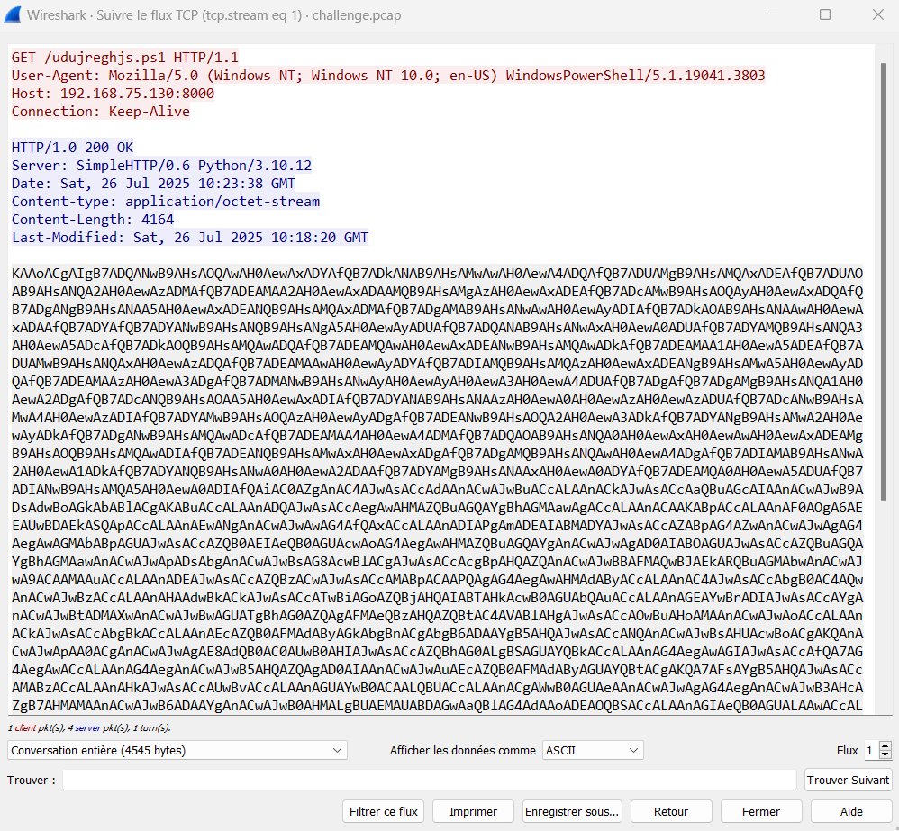
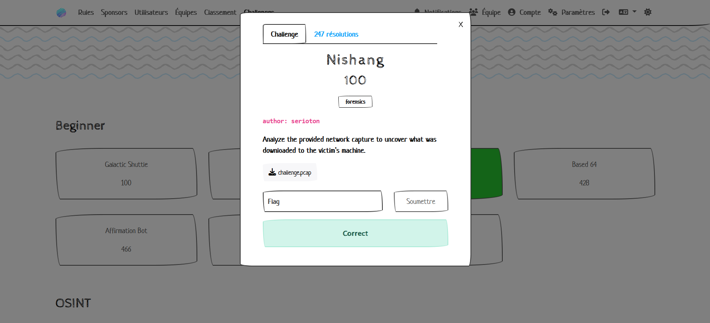

EN Version 
# Solving of Beginners WWCTF 2025
*Welcome to this World Wide CTF ed. 2025 Repository: Nishang*


*Attention : A decoding aof a base64 file followed by another decoding phase : Base64 → UTF 16 with padding → format string  f masks a kind of reverse shell : deobfuscation allows to get the flag that may be displayed* [See WU about Nishang.pdf]


## Statement of the subject




### The Beginners algorithm is a deobfuscation exposed on the W-U. 

"<!-- s0m3_p0w3r5h3ll_0bfusc4710n -->"

✅The flag :
wwf{<font color="gray">s0m3_p0w3r5h3ll_0bfusc4710n</font>}


## Features
Solving topic is easy through deobfuscating the Powershel script. See the descriptive file explaining the steps in Nishang.PDF.🖼️ 

## Installation

1. **Clone the Repository** :
   ```bash

   git clone https://github.com/JackeOLantern/WWCTF2025.git

...
