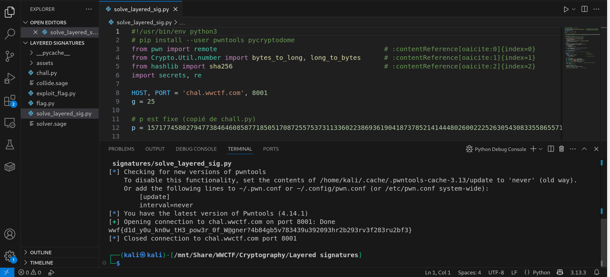

EN Version 
# Solving of cryptography WWCTF 2025
*Welcome to this World Wide CTF ed. 2025 Repository: Layered signatures*


*Attention : A script *.PY : solved_layered_sig.py enables to retrieve the flag* [See WU Layered signatures.pdf]


## Statement of the subject




### The cryptographical algorith is exposed on the W-U. 

"<!-- d1d_y0u_kn0w_tH3_pow3r_0f_W@gner?4b84gb5v783439u392093hr2b293rv3f283ru2bf3 -->"

The flag :
wwf{<font color="gray">{d1d_y0u_kn0w_tH3_pow3r_0f_W@gner?4b84gb5v783439u392093hr2b293rv3f283ru2bf3</font>}


## Features
Solving topic is easy through decrypting conditions.The resolution algorithm is based on : Schnorr/EdDSA and a number theory with cyclic groups and primes generators. See the descriptive file explaining the steps in *.PDF.🖼️ 

## Installation

1. **Clone the Repository** :
   ```bash

   git clone https://github.com/JackeOLantern/WWCTF2025.git

...
